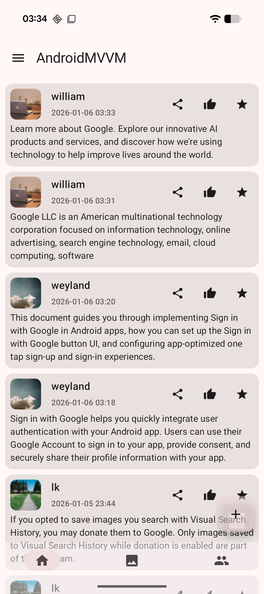
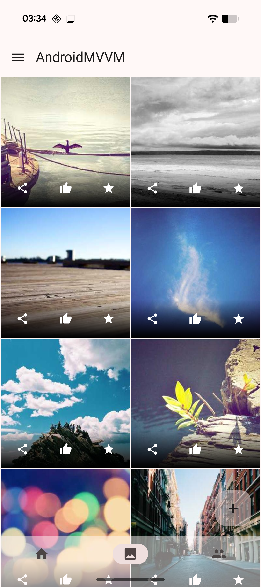
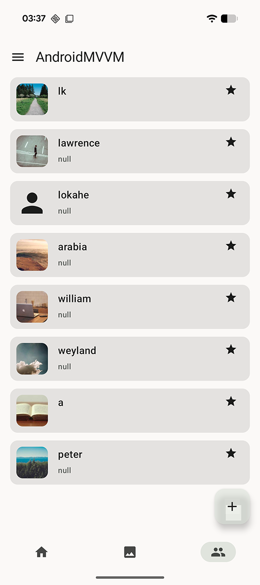
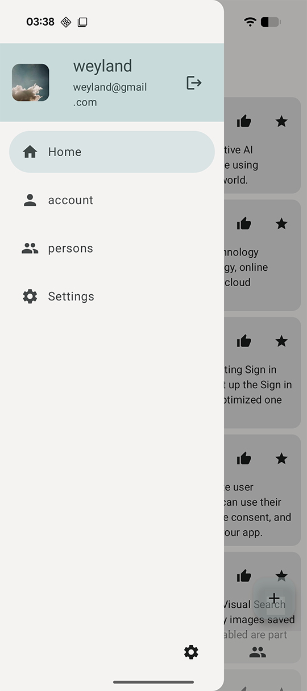
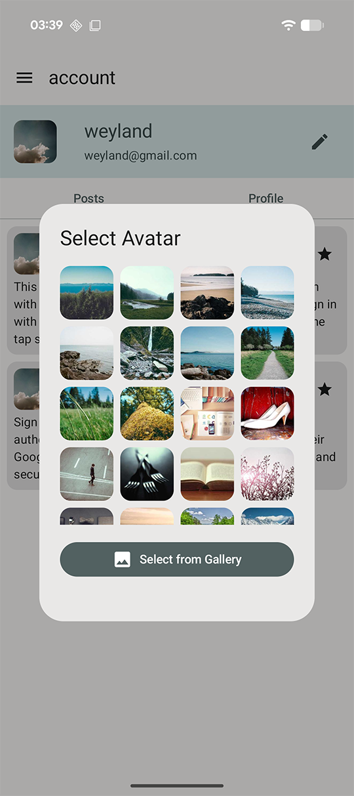

# AndroidMVVM

## MVVM (Model-View-ViewModel) design pattern.
A Simple Social App
Registration + Login (Using Backendless as Backend)

ViewModel+Repository+Hilt+Compose+Flow+Datastore+Room+Retrofit (newest frameworks)



## UI Layer (Compose)
- Displays state from ViewModel (StateFlow)
- Sends user actions (events) to ViewModel
- Stateless, reactive, lifecycle-safe

## ViewModel (@HiltViewModel)
- Holds UI state (StateFlow)
- Handles UI logic
- Calls Repository
- Survives configuration changes
- Injected with Hilt

## Repository
- Single source of truth
- Combines local + remote data
- Decides caching, syncing, fallback logic
- Injected with Hilt

## Local Data Source
### Room
- Stores structured data
- Exposes Flow for reactive queries

### DataStore
- Stores key-value or Proto data
- Emits Flow for preferences/state

## Remote Data Source (Retrofit)
- Handles API calls
- Converts DTOs
- Throws/returns domain-safe results


## to use Backendless as backend, register https://backendless.com/ and follow the steps below:
```kotlin
// app/src/main/java/com/lokahe/androidmvvm/network/Api.kt

object Api {
    const val URL = "https://api.backendless.com/"
    
    // TODO: Replace with your actual Application ID
    const val APP_ID = "YOUR_BACKENDLESS_APP_ID"
    
    // TODO: Replace with your actual REST API Key
    const val RESET_API_KEY = "YOUR_BACKENDLESS_REST_API_KEY"
}
```
