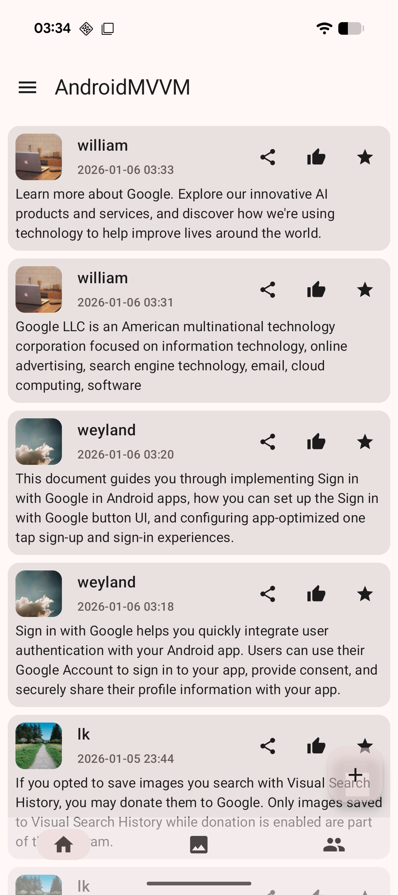
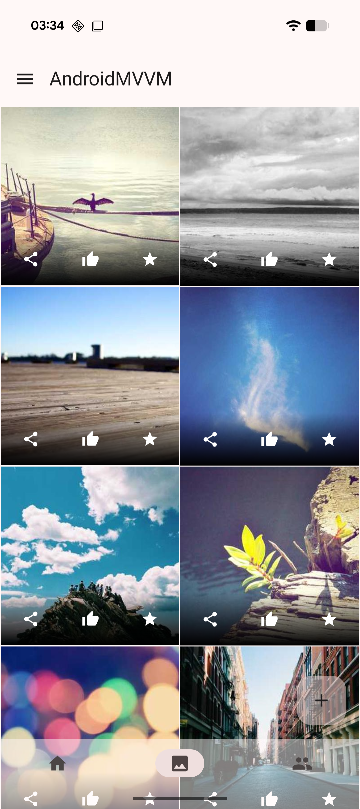
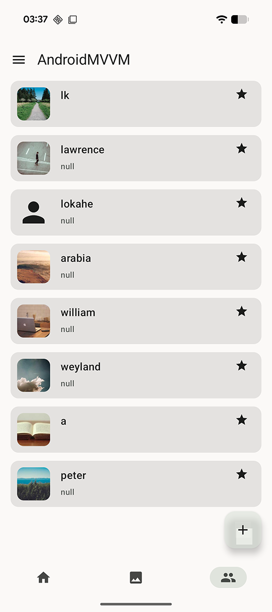
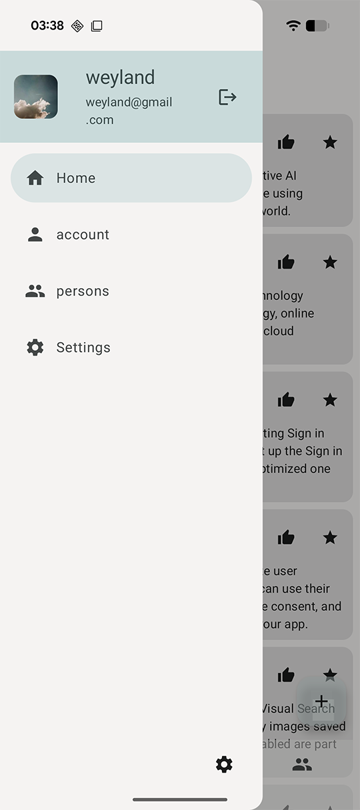
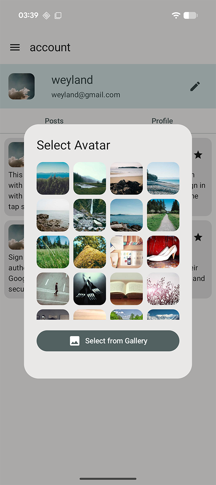
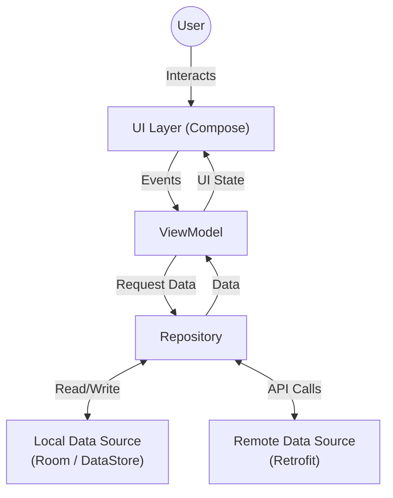

# AndroidMVVM

## Preview

## Architecture: MVVM (Model-View-ViewModel) + UDF (Unidirectional Data Flow)
Registration + Login/out and some simple logic (Using Supabase as Backend)\
ViewModel+Repository+Hilt+Compose+Flow+Datastore+Room+Retrofit (newest frameworks)

```mermaid
graph TD
    User((User)) -->|Interacts| UI["UI Layer (Compose)"]
    UI -->|Events| VM[ViewModel]
    VM -->|UI State| UI
    VM -->|Request Data| Repo[Repository]
    Repo -->|Data| VM
    Repo <-->|Read/Write| Local["Local Data Source\n(Room / DataStore)"]
    Repo <-->|API Calls| Remote["Remote Data Source\n(Retrofit)"]
```

## UI Layer (Compose)
- Displays state from ViewModel (StateFlow)
- Sends user actions (events) to ViewModel
- Stateless, reactive, lifecycle-safe

## ViewModel (@HiltViewModel)
- Holds UI state (StateFlow)
- Handles UI logic
- Calls Repository
- Survives configuration changes
- Injected with Hilt

## Repository
- Single source of truth
- Combines local + remote data
- Decides caching, syncing, fallback logic
- Injected with Hilt

## Local Data Source
### Room
- Stores structured data
- Exposes Flow for reactive queries

### DataStore
- Stores key-value or Proto data
- Emits Flow for preferences/state

## Remote Data Source (Retrofit)
- Handles API calls
- Converts DTOs
- Throws/returns domain-safe results
